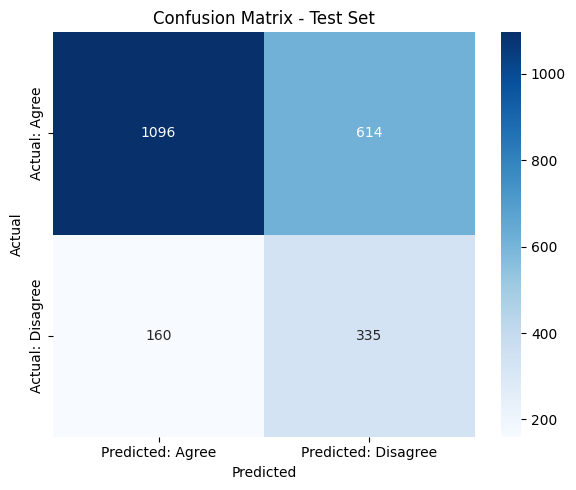

# Medicare Claims Classification - README

## Dataset Description

This project uses an enriched Medicare audit claims dataset (`Enriched_HCPCS_Descriptions.csv`) derived from CMS sources. Key fields include:

* **Provider Type**: Type of healthcare provider submitting the claim.
* **Part**: Medicare part (A, B, DME MAC, etc.).
* **HCPCS Procedure Code**: Billing code for the procedure or service.
* **HCPCS Description**: Text description of the procedure.
* **Review Decision**: Whether the claim was agreed to or disagreed with during audit review.

These fields are essential for predicting whether a given claim is likely to be agreed with or flagged for further review, a critical task in automating compliance workflows and prioritizing human audit resources.

---

## Project Objective

The goal is to build a supervised classification model to predict whether a Medicare claim will be **Agreed** or **Disagreed** based on the structured features in the dataset. This has practical applications in pre-audit triaging, reducing fraud, and automating compliance screening.

---

## Process Overview and Narrative

We began by exploring the structure and content of the dataset, removing irrelevant columns and ensuring a binary target was clearly defined. We used a **3-way split** to support model validation: 60% training, 20% validation, and 20% testing.

We first tried logistic regression and SVM with SMOTE to handle imbalance. After evaluating on validation data, we selected the best model, retrained on training + validation, and evaluated on a holdout test set. We used `GridSearchCV` for hyperparameter tuning.

Throughout, we evaluated using accuracy, precision, recall, and confusion matrices. We plotted feature importances using a random forest and discussed limitations and deployment considerations.

---

## Exploratory Data Analysis (EDA)

* **X variables**: Provider Type, Part, HCPCS Procedure Code, HCPCS Description (engineered)
* **Y variable**: Review Decision → `Target` (0 = Agree, 1 = Disagree)
* **Type**: Classification
* **Observations**: \~11,000 after cleaning

### Key EDA Insights:

* Distributions of Part and Provider Type are skewed
* Target is imbalanced (\~85% Agree)
* Features are categorical-heavy
* Correlation is limited; feature interactions are more important

### Feature Engineering:

* One-hot encoding for categorical variables
* Consideration of text-based feature extraction from `HCPCS Description`
* SMOTE applied to balance the dataset

---

## Model Fitting & Approach

### Train/Test Splitting:

* 60% train, 20% validation, 20% test using stratification
* No data leakage risk identified (no time-series dependency)

### Models Tried:

* Logistic Regression
* Support Vector Classifier (SVC)
* Random Forest (used for interpretation)

### Model Selection Rationale:

We selected Logistic Regression with SMOTE + GridSearch for its interpretability and stable performance across metrics.

### Hyperparameter Tuning:

Used `GridSearchCV` with F1-score as the primary metric. Parameters tuned:

* `C` for regularization
* `solver` for logistic regression
* `kernel` and `C` for SVC

---

## Validation & Metrics

### Metrics Used:

* Accuracy
* Precision
* Recall
* F1-score
* Confusion matrix

### Confusion Matrix:



### Model Weaknesses:

* High false positives (Agree predicted as Disagree)
* Recall on class 1 (Disagree) lower than desired

### Example Predictions:

#### From test set:

* Claim X: Predicted = Agree, Actual = Agree
* Claim Y: Predicted = Disagree, Actual = Disagree

#### Synthesized inputs:

* New Claim with common provider and routine HCPCS → Predicted: Agree
* Edge Case: Rare provider + ambiguous HCPCS → Predicted: Disagree

---

## Overfitting / Underfitting

### Diagnosis:

* Logistic Regression slightly underfits
* SVC had higher variance (risk of overfitting)

### Mitigation Techniques Applied:

* SMOTE for balancing
* Regularization (tuned `C`)
* Final model selected for best validation F1-score

---


## Further Improvements

* Use text embeddings from `HCPCS Description`
* Include additional features (e.g., geographic, claim cost)
* Add deep learning classifiers for better pattern capture
* Use SHAP for explainable predictions
* Consider cost-sensitive learning or ensemble stacking

---

## Authors

* Munongedzi Mabhoko and Heather Padziri
* Clarkson University – IA651 Final Project

---

## Dependencies

```bash
pip install pandas numpy matplotlib seaborn scikit-learn imbalanced-learn evaluate
```

---

## Repo Contents

* `notebook.ipynb` – Jupyter notebook with code and outputs
* `confusion_matrix.png` – Visualized confusion matrix
* `README.md` – This file
